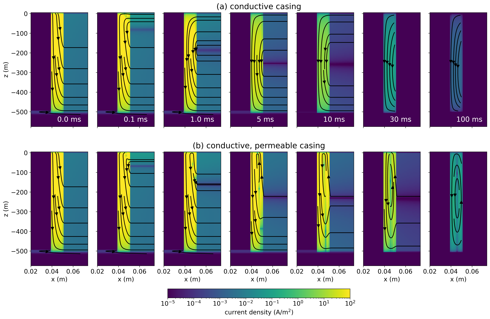

# Impacts of magnetic permeability on electromagnetic data collected in settings with steel-cased wells

Notebooks that accompany the publication: 

Heagy, L.J., Oldenburg, D.W., 2023. Impacts of magnetic permeability on electromagnetic data collected in settings with steel-cased wells. Geophysical Journal International 234, 1092–1110. https://doi.org/10.1093/gji/ggad122. 

The publication is also available on ArXiv: https://arxiv.org/abs/2211.14677. 



## Summary 
Electromagnetic methods are increasingly being applied in settings with steel infrastructure. These include applications such as monitoring of CO2 sequestration or even assessing the integrity of a wellbore. In this paper, we examine the impacts of the magnetic permeability of a steel-cased well on electromagnetic responses in grounded source experiments. We consider a vertical wellbore and simulate time and frequency domain data on 3D cylindrical meshes. Permeability slows the decay of surface electric fields in the time domain and contributes to a phase shift in the frequency domain. We develop our understanding of how permeability alters currents within, and external to, the casing by focussing first on the time domain response and translating insights to the frequency domain. Following others, we rewrite Maxwell's equations to separate the response into terms that describe the magnetization and induction effects. Magnetic permeability impacts the responses in two ways: (1) it enhances the inductive component of the response in the casing, and (2) it creates a magnetization current on the outer wall of the casing. The interaction of these two effects results in a poloidal current system within the casing. It also generates anomalous currents external to the casing that can alter the geometry and magnitude of currents in the surrounding geologic formation. This has the potential to be advantageous for enhancing responses in monitoring applications.

## Running the notebooks 

To run this, you can:
1. can clone or download the repository. From the command line 
   ```
   git clone https://github.com/simpeg-research/heagy-oldenburg-2023-casing-permeability.git
   ```
  
2. Change into the `heagy-oldenburg-2023-casing-permeability` directory 
   ```
   cd heagy-oldenburg-2023-casing-permeability
   ```
  
3. Create the environment 
   ```
   conda env create -f environment.yml
   ```

4. Activate that environment 
   ```
   conda activate casing
   ```

5. Run the script, or launch Jupyter using 
   ```
   jupyter lab
   ```


